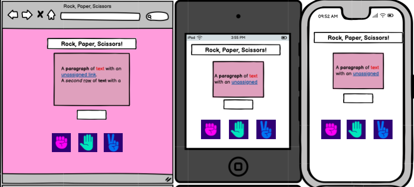
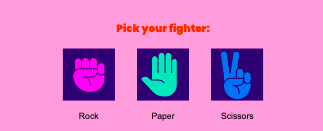
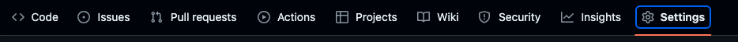
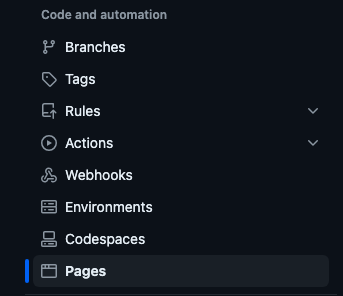

# Rock, Paper, Scissors

## Site Overview
Rock, Paper, Scissors is a simple, fun, and user-friendly game enjoyed by both children and adults. Players choose one of three options (rock, paper, or scissors) while the computer randomly selects its own choice. With each round, the outcome and winner is random which adds excitement! 

Live site: https://amelia5p.github.io/Rock-Paper-Scissors/

 

<!-- TOC start (generated with https://github.com/derlin/bitdowntoc) -->

<!-- TOC end -->

  

# User Experience

## Design

Wireframes were made in Balsamiq to ensure a clear and easy development process. The color palette was created using Muzli colors, the colors used are quite loud and exciting creating a fun experience and environment for users. The images used are a pop of color for the same purpose.  The 'Poppins' font was chosen as it is easily legible and attractive. Sans Serif is used as the fallback font.

### Wireframes

### Color Palettes

### Typography

## User Stories

### First time visitor goals
* As a first time user, I want to easily understand the purpose of the site and the game.
* As a first time user, I want to be excited, intrigued and feel I am in a fun environment.

# Structure
The website is one page only.

## Features

### Heading
The heading shows the game name: Rock, Paper, Scissors with a clear contrast to the background so it stands out.

### Game Area

## Buttons
There are three interactive buttons for rock, paper and scissors and a clear instruction for the user to chose an option.

## Score
The score is counted for both the computer and the player up to 3 as stated in the rules.

## Alert
Once the player or computer reaches a score of 3 there is an alert stating the winner of the game. Once you dismiss the alert, the game will reset making it very user friendly.

### Responsiveness

The site is responsive from 320px and functions on a range of screen sizes. 

### Accessibility
Aria-lables, alt text, color contrast and font selections were thoughtfully chosen to ensure an inclusive and accesible user experience.

### Future features

# Testing

## Feature Testing 

## Browsers Compatibility
The site was tested using Dev Tools on Google Chrome, Safari, Firefox and Edge and functions and appears as it should across all major browsers. I also tested it on an Iphone 12 mini and a Samsung Galaxy S21 ultra.

## Responsiveness

Responsiveness was tested with Chrome Dev Tools and by changing the viewport from 320px and upwards. I also checked responsiveness on 'Am I Responsive' and Responsive test tool.  I also tested it on an Iphone 12 mini and a Samsung Galaxy S21 ultra.

## Lighthouse Testing
The lighthouse testing was successful with scores above 90 for all four ratings (Performance, Accessibility, Best Practices and SEO).

## Code Validation

#### HTML

HTML was tested through the W3C validator with no errors:

 

#### CSS

The CSS stylesheet was tested through the W3C Validator with no errors:

 

# Bugs

Debugging and problem solving was done consistently throughout the development process.

List of some issues that arose:

- I had a curly bracket in the wrong place so that my if statements were wrongly placed outside of the playGame function, fixed this by simply moving the bracket.
- The score would only get to 2 before the DOM would alert the winner before updating the results, I made sure that the score was updated first, and then check for a winner after that, I fixed this by setting delay time. 
- I did not write the code for media queries correctly, so therefore it was not being applied, after inspection I fixed the code.
- The images in the computer and player's choice section when opened pushed content up, used display block to keep them from doing this as a fix.

# Deployment

This site has been built on Gitpod, the code was then pushed to Github where it was deployed.

### <ins>Step 1:</ins>

From the <a href="https://github.com/Amelia5p/Rock-Paper-Scissors" target="_blank">Github repository</a> click on settings which is near the top op the right side of the page.

### <ins>Step 2:</ins>
From the options listed on the left hand side of the page, click 'Pages'.

### <ins>Step 3: </ins>
From the drop down menu under source select deploy from branch. From the dropdown menu's under branch select 'Main' and 'Root' then click save.

### <ins>Result:</ins>
The page will be refreshed and you will see the link to the live site.

## Cloning Repository

### <ins> Step 1: </ins>

From the <a href="https://github.com/Amelia5p/Rock-Paper-Scissors" target="_blank">Github repository</a> click on the 'code' button.

### <ins> Step 2:</ins>

Click 'local' on the top of the drop down menu and copy the URL.

### <ins>Step 3: </ins>

Open Git Bash on windows and change the working directory to the location where you want the cloned directory.

### <ins>Step 4: </ins>

Type 'Git clone' followed by a space and paste the URL previously copied, hit enter.

### <ins> Result: </ins> 

You now have a local copy of the Github repository.

## Forking Repository

### <ins>Step 1:</ins>

From the <a href="https://github.com/Amelia5p/Rock-Paper-Scissors" target="_blank">Github repository</a> click on the 'fork' button in the top right corner of the page. 

### <ins>Step 2:</ins> 

Choose to copy only the main branch or all branches to the new fork.

### <ins>Step 3: </ins>

Click Create a Fork.

### <ins>Result:</ins>

There is now a forked copy on Github.

# Credits

## Image

- The only image I sourced was from Vecteezy https://www.vecteezy.com/vector-art/690792-rock-paper-scissors-hand-icons

## Favicon

- <a href="https://favicon.io/favicon-converter/#google_vignette"> Favicon Converter</a>
- <a href="https://www.canva.com/"> Canva</a>
 
## Other
- <a href="https://fonts.google.com/"> Google Fonts</a>
- <a href="https://www.w3schools.com/"> W3schools</a>
- <a href="https://colors.muz.li/"> Muzli Colors</a>
- <a href="https://imageresizer.com/crop-image">Resize images</a>

## Code / Educational Resources
- Code institutes 'Love Maths' project.
- <a href="https://www.w3schools.com/"> W3schools</a>
- https://www.c-sharpcorner.com/article/show-and-hide-divs-on-button-click-with-javascript/ 

# Acknowledgements 
This is project two, created for the Code Institutes Full Stack Web Developer (eCommerce) course. I would like to thank my cohort facilitator and the Code Institute team for their support.